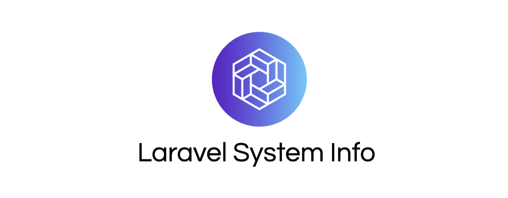

# Laravel System Info



A minimalist Laravel package to expose system information (Laravel version, PHP version, installed packages, and outdated packages) via a secure API endpoint. This package is designed to allow centralized monitoring of Laravel sites. It uses its own token-based authentication middleware, independent of Sanctum or other auth systems.

The package supports Laravel 9+ for the moment.

## Installation

1. Require the package via Composer:

    ```
    composer require flobbos/laravel-system-info
    ```

2. Install the package (generates a token and publishes config):

    ```
    php artisan laravel-system-info:install
    ```

    This will add `SYSTEM_INFO_TOKEN=your-generated-token` to your .env file and publish `config/laravel-system-info.php`. Copy the token to your ServerSync dashboard for API authentication.

## Usage

-   The package adds a `/api/system-info` endpoint, protected by the generated token.
-   Fetch info with a GET request using Bearer auth:

    ```
    curl -H "Authorization: Bearer your-token" https://your-laravel-site.com/api/system-info
    ```

-   Response example:

    ```json
    {
    	"laravel_version": "11.0.0",
    	"php_version": "8.3.1",
    	"installed_packages": [
    		{
    			"name": "laravel/framework",
    			"version": "11.0.0"
    			// ... other packages
    		}
    	],
    	"outdated_packages": [
    		{
    			"name": "some/package",
    			"version": "1.0.0",
    			"latest": "1.1.0"
    		}
    	]
    }
    ```

-   You can use this endpoint to fetch and display info for Laravel sites.

## Configuration

-   `config/laravel-system-info.php`:

    ```php
    <?php

    return [
        'token' => env('SYSTEM_INFO_TOKEN', null),
    ];
    ```

-   Regenerate token if needed by rerunning the install command.

## Security

-   The endpoint is protected by a custom middleware checking the Bearer token from .env.
-   Ensure `APP_DEBUG=false` in production to avoid exposing sensitive info on errors.
-   The package doesn't access .env variables; it only runs Composer commands for package info.

## Compatibility

-   Laravel 9.0 and above.

## License

MIT License. See [LICENSE](LICENSE) for more information.
